# HW 7 Alex Fatyga

Use CODVID-19 API (Documentation using postman) to build mobile application that displays:
- CODVID cases per country on a MAP
- CODVID cases per country Live on a MAP (changes)
- CODVID cases per country based on a date.
- Summary of total cases for the world
- Live Summary for the World   
Stretch goal:
- Display data per Province
- User can put their address and track CODVID-19 in their neighborhood (Only in countries where regional data is provided)
 
You should document your architecture and design decisions as you go on GitHub.
Provide screenshots and video links for all steps in your GitHub repository

# How to Use It
Works only on Apple iPhone
- npm install -g expo-cli
- expo init AwesomeProject
- cd AwesomeProject
- replace the app.js in this folder with the app.js in the repo
- update key in app.js with a google api key that may be used for geocoding
- npm install react
- npm install react-native
- npm install react-native-map
- npm install react-native-geocoding
- npm install react-native-picker-select
- npm start
- Download Expo app on iOS, Scan QR Code on the app
- May use app to change date, change location of the marker and the statistics will update, press the button for live overall statistics
- NOTE: If there are issues with changing the date on the app, open App.js and resave the file (without changing anything in the file) and let the app reload until it starts working again - unknown issue that resolves itself after letting the app refresh!

# How It Works
The first step is to allow the app to user your location. After allowing the app to use your location, a map loads that shows your current location and the statistics in your country (number of cases, deaths, recovered and new cases, deaths and recovered). You can change the date of the map from live to other dates using the RNPickerSelect and back to live. You can lift the marker to change it to a different country and the statistics will update to the current date selected. When permission is initially given, the country is determined through the longitude and latitude using react-native-geocoding and the country is passed to getJson(country) which then returns the response from the API call in getJson. 
  
From there, I get today's date to then get the correct statistics and then update the states to reflect this date so the statistics can be displayed on the mobile app. Users can then change the date that they want the statistics to reflect. This calls the function onDateChange which then calls getJson again and goes through a similar process as previously but instead onDateChange receives the new date and not the initial latitude and longitude. onDateChange makes sure to get the statistics from the corresponding date selected. I keep track of the date, latitude, longitude, and the various statistics with states; however, states do no consistently immediately update and therefore, I pass latitude and longitude or the date or country instead of relying on the state to have updated after I called setState. 
  
When a user changes the location of the marker, onRegionChange is called upon onDragEnd (which mean the marker is no longer being dragged and has been place in its new location) and react-native-geocoding is used again to determine the country from the latitude and longitude coordinates and another API call occurs to receive the new statistics and the date state is checked so the correct date information is displayed. Users may also click the button to receive live data of the whole world which has a pop up alert that displays the information. Upon clicking the button, handleSubmit is called which then calls getLiveJson which makes the API call, the JSON return is then broken up and calls alert with the proper information. 

# Screenshots + Video of Finished Product Explained
Below is a link to a video demo of me using the app on my iPhone  
[Link to video demo](https://www.youtube.com/watch?v=pxIZ49NdnUw&feature=youtu.be)   
Loading up before statistics are found for your location:  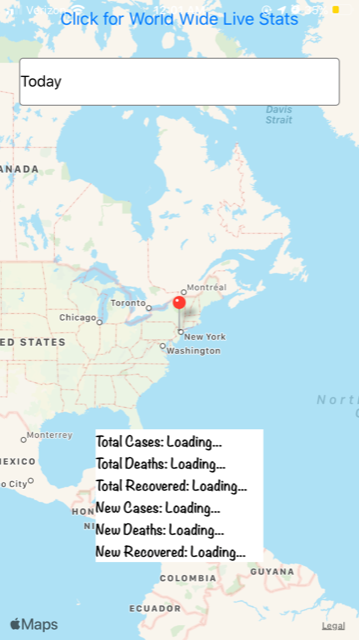   
Ability to change date:  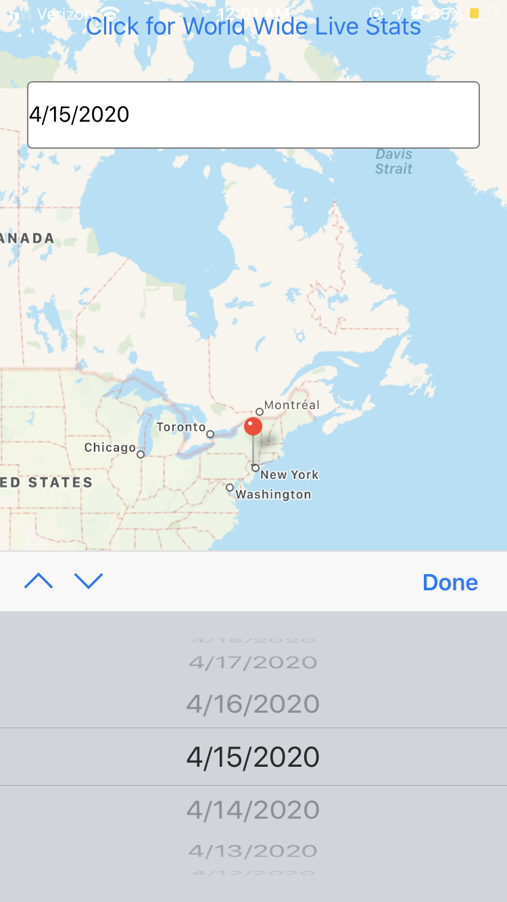   
Statistics on 4/15:  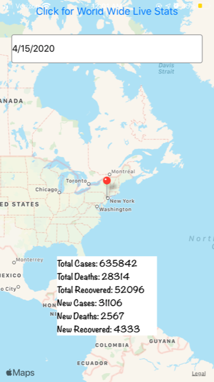   
After clicking for live worldwide stats:  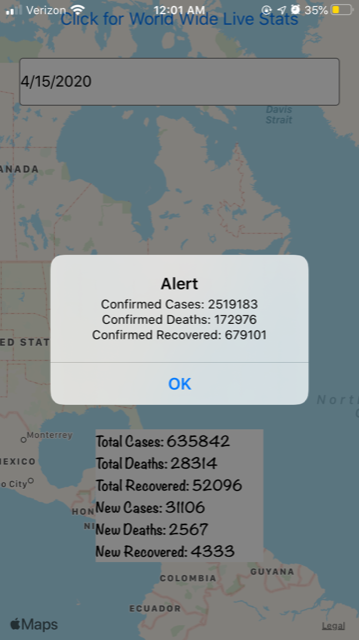   
Statistics on 4/15 and moved to Canada:  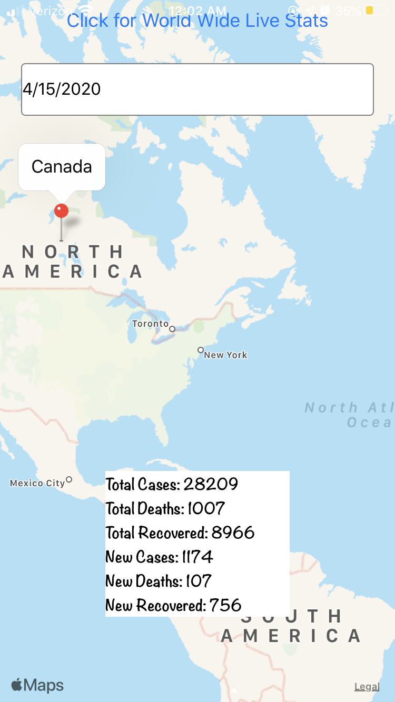   
Changed to 4/18, still in Canada     
Moved to Latvia, with same date  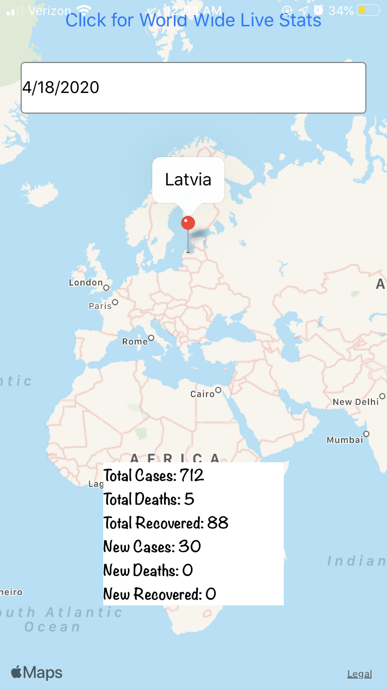   
Changing date in Latvia  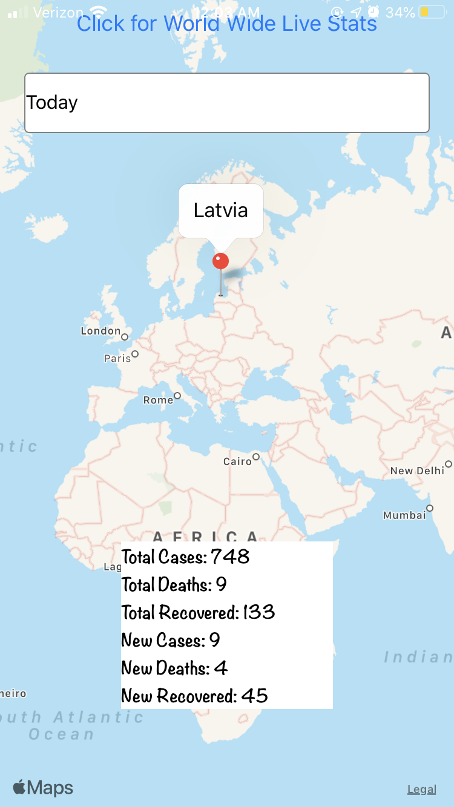   
Moved to France  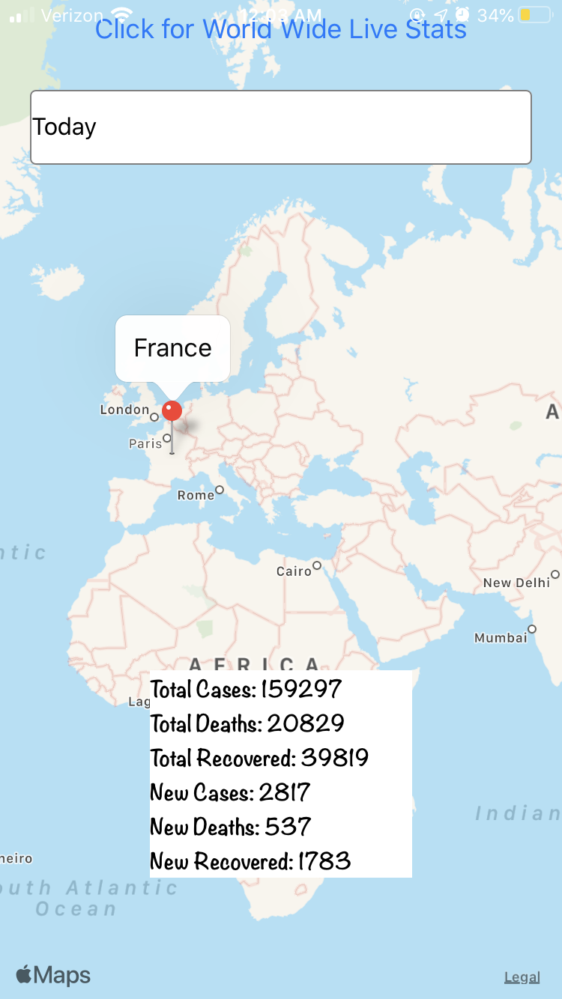   

# Steps
1. Setup your REACT Native Environment
2. Go through REACT native Tutorial
- Build Hello Applications
- Run Hello applications on emulator and your phone.
- It will be great to run it on two phones if you can (iOS and Android)
3. Develop use case to display a map.  (GitHub location)
4. On separate branch, exercise the CODVID-19 API (Documentation using postman) and display the data in your application as text.  Be fancy!  Style your results.
5. Overlay the data on the maps.

## Milestone Deadlines
- Step 1 Completed - April 8, 2020 Done     
- Step 2 Completed - April 10, 2020 Done  
- Step 3 Completed - April 12, 2020  Done  
- Step 4 Completed - April 17, 2020  Done  
- Step 5 Completed - April 24, 2020  

# Milestone 2-4 Explanations
## Milestone 2
I went through the tutorials and was able to create a hello world application on my cell phone (iPhone) and emulator (Pixel 3). I then tried a few different examples on my phone. The following images show my work - screenshots on my phone and the process of getting it to work on my phone:  
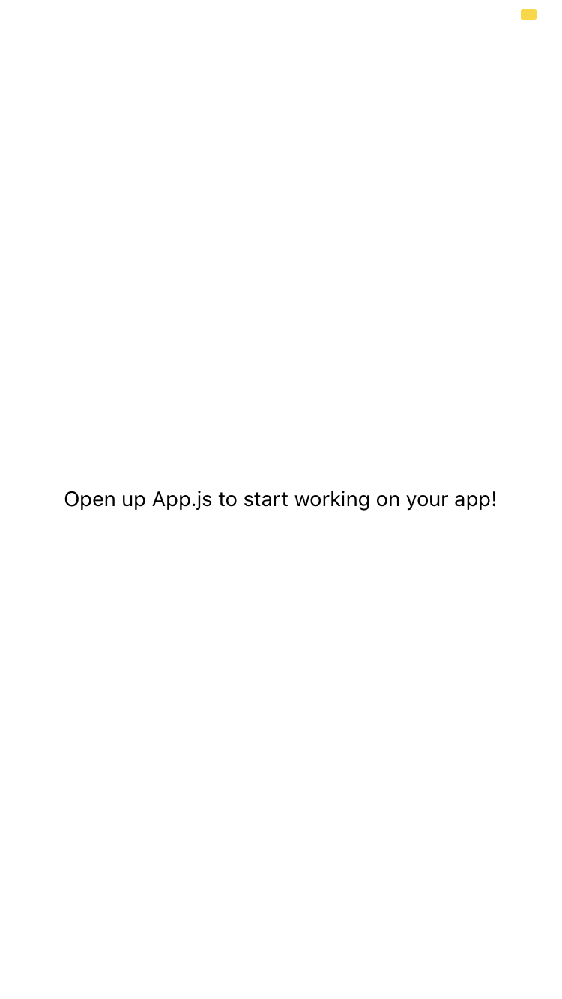    
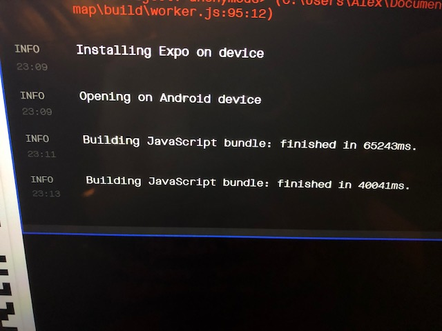    
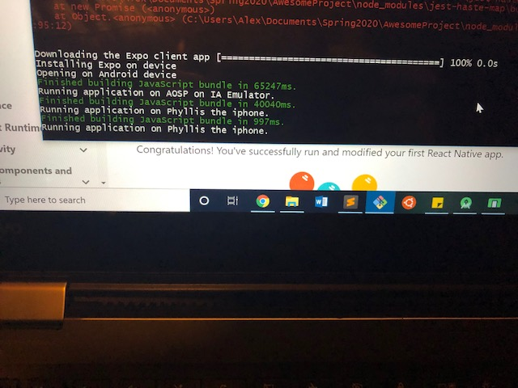 - Phyllis the iphone is my iphone   
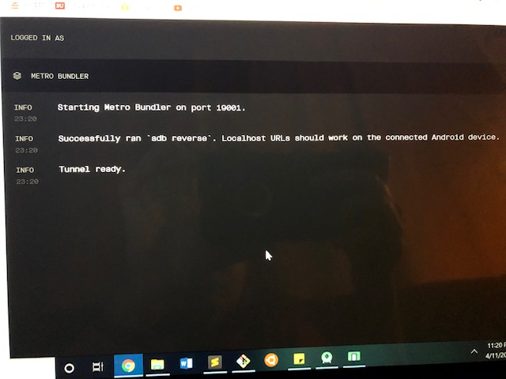    
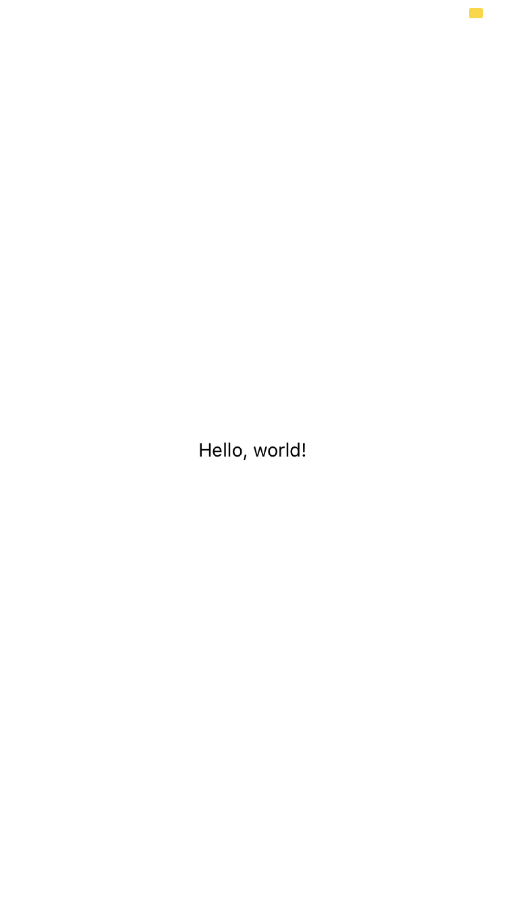    
    
    
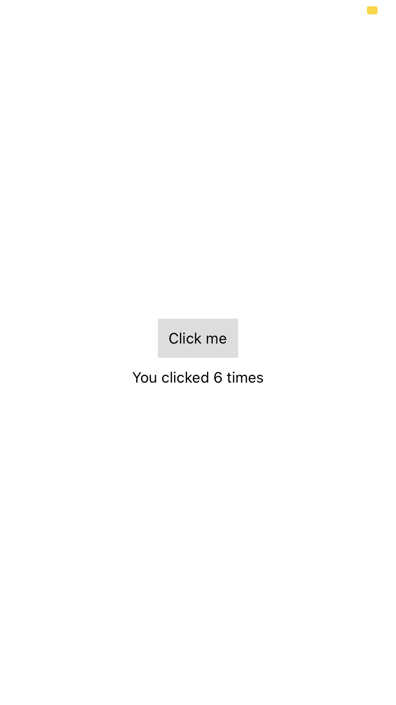    
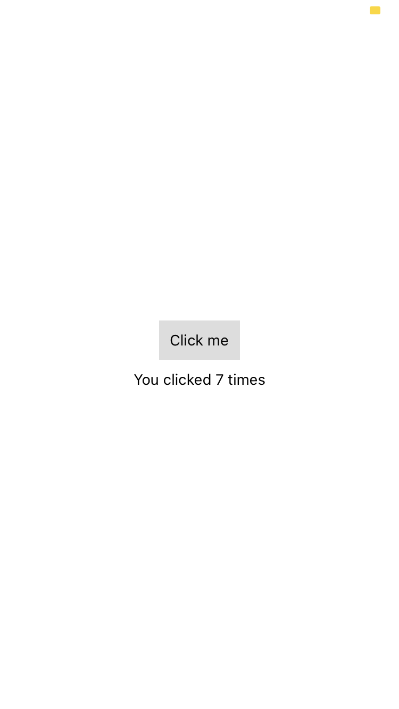    
app.js in the Step2 folder is the hello world file

## Milestone 3
I had difficulty trying to get a more difficult use case but realized I just needed to understand how maps in react-native worked. I ccompleted step 3 by having an app that is set to photonics on a map and allows the marker to be moved and gives an alert of the new coordinates. I play on spending the next couple days trying to understand react-native-maps even further. Attached are screenshots of my app working.  
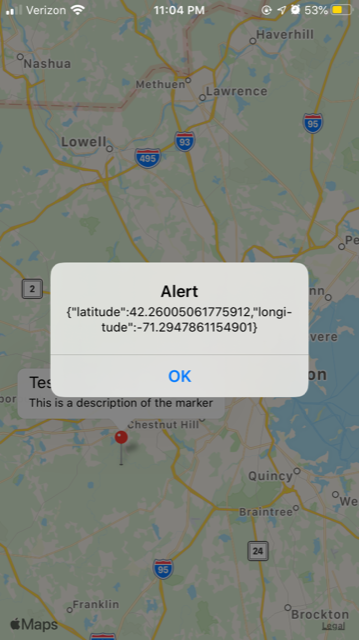    
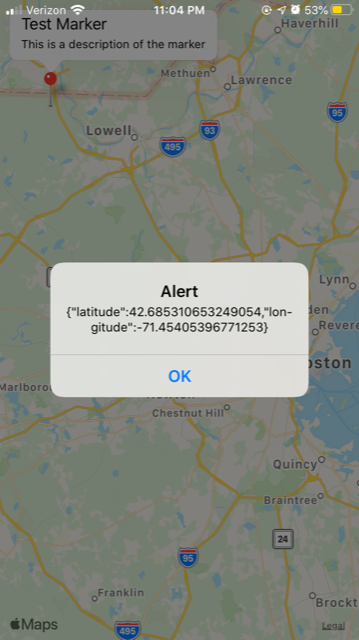    
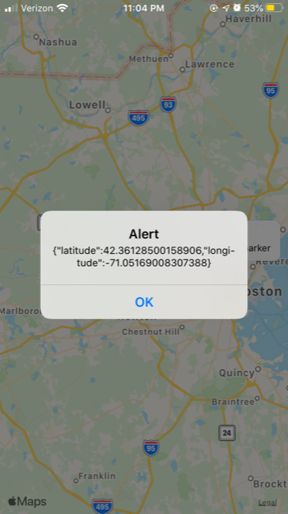    
app.js is in the Step3 folder that was able to do this.

## Milestone 4
Milestone 4 is located in branch Step4 and in a folder called Step4 - There are 3 different javascript files for the 3 different applications I made. USUsingSummary.js and byCountry.js created the same view but used the API differently - they created the 1st picture. App.js allowed the user to put in a country and click a submit button to receive the statistics listed on the same view and are shown in the next 3 pictures. 
